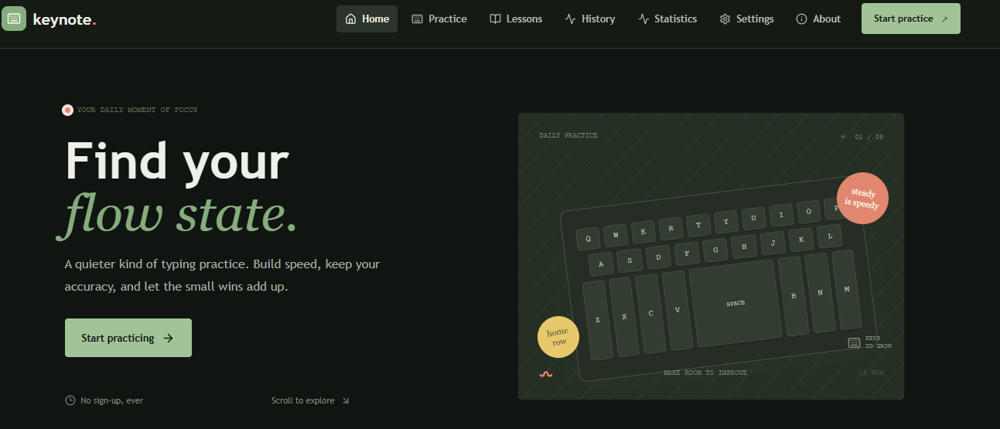
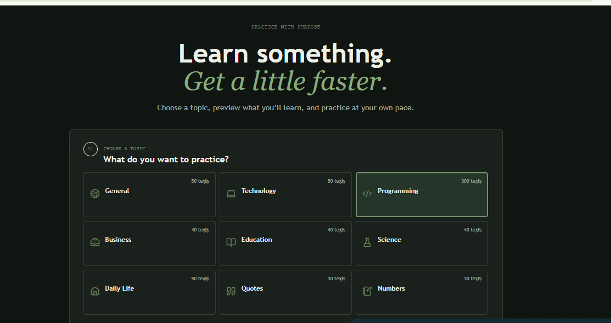

# typing-practice
A modern React and TypeScript typing practice platform featuring educational content, programming exercises, progress tracking, statistics, history, and customizable practice settings.
# ⌨️ Typing Practice

A modern web application designed to help users improve their typing speed, accuracy, and consistency through interactive typing practice.

## 🌐 Live Demo

**[Open Typing Practice](https://typingpractice-tm.netlify.app/)**

## 🖥️ Screenshots

### Home Page



### Practice Page



## 📖 About the Project

Typing Practice is a web-based application that helps users practice and improve their typing skills.

The application provides an interactive typing environment where users can practice typing and improve their speed and accuracy.

## ✨ Features

* ⌨️ Interactive typing practice
* 🎯 Accuracy tracking
* ⚡ Typing speed measurement
* 📊 Practice performance
* 📱 Responsive user interface
* 🌐 Available online

## 🛠️ Technologies

* **React**
* **TypeScript**
* **Vite**
* **CSS**
* **Git**
* **GitHub**
* **Netlify**

## 🚀 Run Locally

Clone the repository:

```bash
git clone https://github.com/Tese2/typing-practice.git
```

Open the project:

```bash
cd typing-practice
```

Install dependencies:

```bash
npm install
```

Start the development server:

```bash
npm run dev
```

Then open the local URL provided by Vite.

## 📦 Build

```bash
npm run build
```

## 🚀 Deployment

The application is deployed using Netlify.

**Live website:**
https://typingpractice-tm.netlify.app/

## 📁 Project Structure

```text
typing-practice/
├── public/
├── src/
├── home.png
├── practice.png
├── package.json
├── README.md
└── vite.config.ts
```

## 👨‍💻 Author

**Tese**

## 📄 License

This project is for learning and development purposes.
